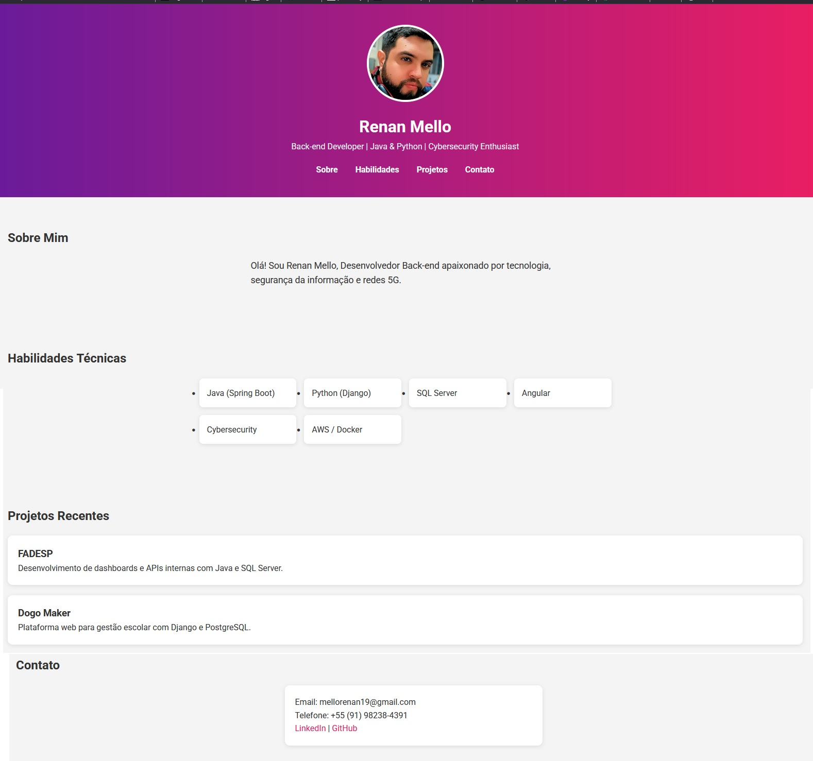

# Projeto Perfil +praTI e Codifica

Este é um projeto estático desenvolvido com HTML5 semântico e CSS moderno (Flexbox, variáveis, media queries) para exibir meu perfil profissional de forma elegante e responsiva.

## Tecnologias Utilizadas

- HTML5
- CSS3
- Google Fonts
- Favicon personalizado
- Media Queries para responsividade

## Objetivo

Exibir informações pessoais de maneira clara e visualmente atraente, com navegação suave e compatibilidade em diferentes dispositivos.

## 🚀 Resultado Final

